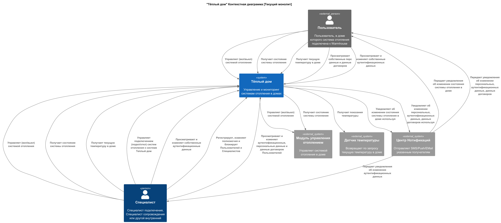
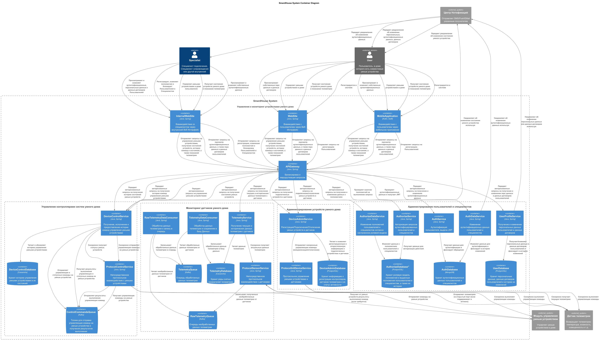
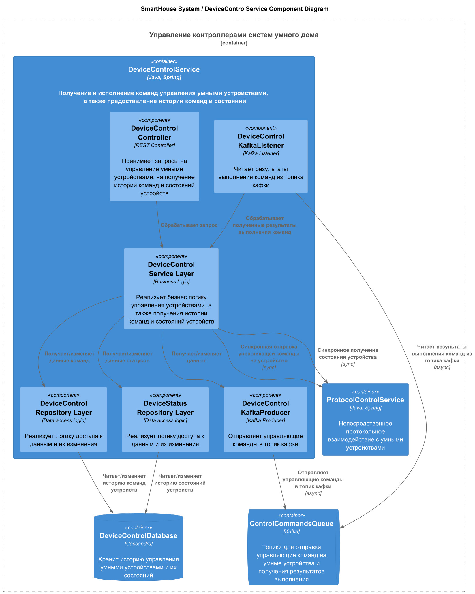
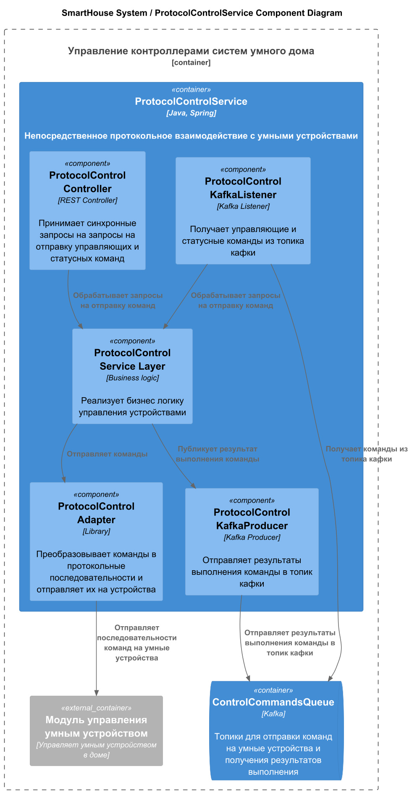
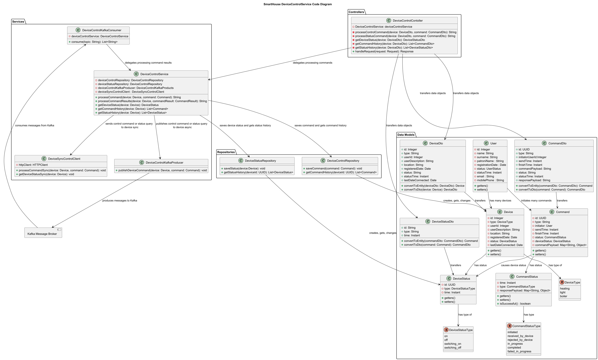

# Задание 1. Анализ и планирование

### 1. Описание функциональности монолитного приложения

**Управление системами отопления:**
- **Пользователи** и **Специалисты** могут управлять (вкл/выкл, в том числе отложенно по времени) системами отопления в домах через веб-интерфейс
- **Пользователи** и **Специалисты** могут получать состояния (включено/включается/выключено/выключается) систем отопления в домах через веб-интерфейс
- **Система** управляет (вкл/выкл) системами отопления в домах путем отправки команд от сервера к модулям управления систем отопления
- **Система** получает состояния систем отопления в домах по запросу пользователей через веб-интерфейс
- **Система** сохраняет изменения состояний систем отопления в домах в своей Базе Данных и уведомляет о них пользователей

**Мониторинг температуры в домах:**
- **Пользователи** и **Специалисты** могут получать текущую температуру отопления в домах через веб-интерфейс
- **Система** получает показания температуры в домах путём опроса датчиков систем отопления и сохраняет в своей Базе Данных

**Администрирование систем отопления в домах:**
- **Специалисты** могут подключать и отключать системы отопления в домах к **Системе**
- **Система** позволяет подключать и отключать системы отопления в домах **Специалистам** и не позволяет **Пользователям**

**Администрирование пользователей и специалистов:**
- **Пользователи** могут видеть собственные персональные данные и данные договоров в веб-интерфейсе
- **Пользователи** и **Специалисты** могут видеть и изменять собственные аутентификационные данные
- **Специалисты** могут регистрировать, изменять полномочия и блокировать **Пользователей** и **Специалистов**
- **Специалисты** могут видеть и изменять аутентификационные, персональные данные и данные договоров **Пользователей**
- **Система** выключает системы отопления в домах при отключении **Пользователей** от **Системы** 
- **Система** позволяет создавать новых и изменять существующих **Пользователей** и **Специалистов** другим **Специалистам** с полномочиями и не позволяет **Специалистам** без полномочий и **Пользователям**
- **Система** проверяет полномочия **Пользователей** и **Специалистов** на выполнение действий в **Системе**
- **Система** сохраняет персональные данные и данные договоров **Пользователей** в своей Базе Данных
- **Система** уведомляет **Пользователей** об изменении их персональных, аутентификационных данных, данных договоров

### 2. Анализ архитектуры монолитного приложения

- **Язык:** Java
- **База данных:** Реляционная БД PostgreSQL
- **Архитектура:** Монолитная, все компоненты в одном приложении (обработка запросов, бизнес-логика, работа с банными)
- **Взаимодействие:** Синхронное взаимодействие. Все запросы обрабатываются последовательно. Большая связанность между компонентами.
- **Пользовательский интерфейс:** Веб-интерфейс
- **Масштабируемость:** Ограничена вертикальным масштабированием, т.к. невозможно масштабировать отдельные компоненты монолитного приложения
- **Развёртывание:** Ограничено необходимостью останавливать всё монолитное приложение.

### 3. Определение доменов и границы контекстов

- #### домен **Управление системами отопления в домах** #### [-> целевой домен Управление контроллерами систем умного дома]
  - поддомен **Взаимодействие с пользователями**
    - контекст **Отображение состояния систем отопления в домах**
    - контекст **Обработка команд управления системами отопления в домах от Пользователей**
    - контекст **Сохранение состояний систем отопления в домах в Базе Данных**
  - поддомен **Взаимодействие с модулями управления систем отопления в домах**
    - контекст **Взаимодействие с модулями управления систем отопления в домах**
- #### домен **Мониторинг температуры в домах** [-> целевой домен Мониторинг датчиков умного дома]
  - поддомен **Взаимодействие с пользователями**
    - контекст **Отображение температуры в домах**
  - поддомен **Взаимодействие с датчиками температуры**
    - контекст **Взаимодействие с датчиками температуры в домах**
    - контекст **Сохранение полученных температурных показаний в Базе Данных**
- ##### домен **Администрирование систем отопления в домах** [-> целевой домен Администрирование устройств умного дома]
  - поддомен **Администрирование систем отопления в домах**
    -  контекст **Подключение/отключение систем отопления в домах к Системе**
    -  контекст **Управление системами отопления в домах**
- ##### домен **Администрирование пользователей и специалистов**
  - поддомен **Персональные данные пользователей и договоров**
    - контекст **Управление данными пользователей и договоров**
  - поддомен **Аутентификационные данные пользователей и специалистов**
    - контекст **Управление аутентификационными данными пользователей и специалистов**
    - контекст **Валидация аутентификационными данными пользователей и специалистов**
  - поддомен **Полномочия пользователей и специалистов**
    - контекст **Управление полномочиями пользователей и специалистов**
    - контекст **Валидация полномочий пользователей и специалистов**

### **4. Проблемы монолитного решения**

- **ограниченное масштабирование** монолитной архитектуры: нет возможности горизонтального масштабирования, только ограниченное вертикальное. Масштабируется только приложение целиком, а не конкретные модули
- **ограниченная скорость разработки и сложность управления командой**: общая кодовая база приводит к конфликтам и блокировкам, замедляющим процессы и требующим отдельной фасилитации. Долгий онбординг
- **ограниченная скорость доставки изменений**: необходимость остановки всего приложения при развёртывании требует тщательного планирования поставок изменений и полного тестирования приложения, что замедляет скорость поставки изменений и развития бизнеса 
- **ограниченная доступность и надежность**: необходимость остановки всего приложения при развёртывании означает полную недоступность и дополнительные риски при старте (лавинообразные потоки запросов и данных от устройств). Высокая связанность модулей приложения повышает риск наведенных ошибок, несогласованных изменений и т.д. Повышение нагрузки на один модуль может повлиять на стабильность всех модулей приложения

### 5. Визуализация контекста системы — диаграмма С4

[Контекстная диаграмма текущего монолитного решения](diagrams/context/Context.jpg)

# Задание 2. Проектирование микросервисной архитектуры

**Диаграмма контейнеров (Containers)**

[Контейнерная диаграмма микросервисного решения](diagrams/container/Container.jpg)

**Диаграмма компонентов (Components)**

Для сервисов домена Управление контроллерами систем умного дома:
1. [Компонентная диаграмма сервиса DeviceControlService](diagrams/component/Component_DeviceControl.jpg)
 

2. [Компонентная диаграмма сервиса ProtocolControlService](diagrams/component/Component_ProtocolControl.jpg)

**Диаграмма кода (Code)**

Для сервиса DeviceControlService домена Управление контроллерами систем умного дома:

[Диаграмма кода сервиса DeviceControlService](diagrams/code/DeviceControlService_Code.jpg)

# Задание 3. Разработка ER-диаграммы

Добавьте сюда ER-диаграмму. Она должна отражать ключевые сущности системы, их атрибуты и тип связей между ними.

Четвёртое задание — дополнительное. Его можно сделать по желанию. Чтобы ревьюер быстрее проверил ваше решение, укажите, сделали вы это задание или нет. Для этого оставьте нужный эмодзи около заголовка задания:

✅ — вы выполнили задание.

❌ — вы пропустили задание.

# ✅ ❌ Задание 4. Создание и документирование API

### 1. Тип API

Укажите, какой тип API вы будете использовать для взаимодействия микросервисов. Объясните своё решение.

### 2. Документация API

Здесь приложите ссылки на документацию API для микросервисов, которые вы спроектировали в первой части проектной работы. Для документирования используйте Swagger/OpenAPI или AsyncAPI.